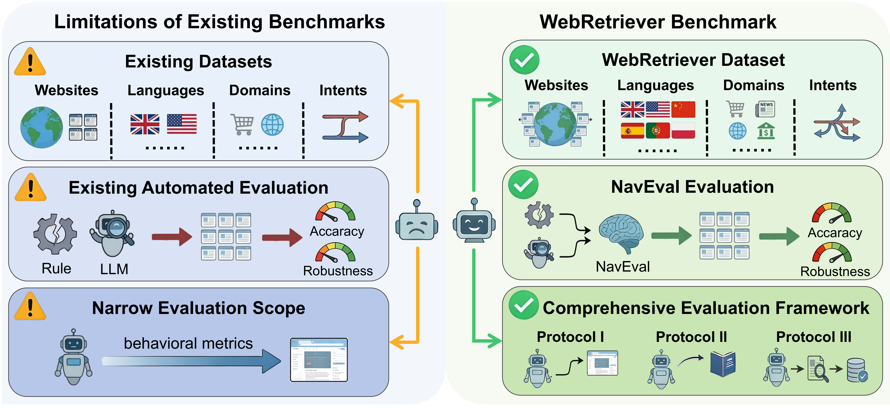

# WebRetriever
WebRetriever: A Large-Scale Comprehensive Benchmark for Efficient Web Agent Evaluation

 
WebRetriever: 一个大规模综合基准用于高效 Web 智能体评测
## Abstract
As web agents increasingly demonstrate capabilities in automated task execution, the development of robust evaluation frameworks for assessing their navigation and task completion performance has emerged as a critical research priority. However, existing benchmarks exhibit several fundamental limitations. First, they suffer from insufficient scale and limited domain diversity, thereby constraining comprehensive evaluation of cross-domain generalization. Second, prevailing LLM-as-Judge evaluation methodologies inadequately capture fine-grained interaction semantics, particularly regarding precise query formulation and filtering operations. Third, current benchmarks predominantly emphasize navigation success metrics while neglecting critical requirements for real-world deployment scenarios. To address these limitations, we introduce WebRetriever, a large-scale benchmark encompassing 800 websites and 1,500 tasks across diverse domains, including consumer, professional, and enterprise sectors, with comprehensive coverage of user intent patterns. We propose NavEval (Navigation Evaluation), a novel LLM-as-Judge framework that leverages rich interaction context beyond visual screenshots, achieving state-of-the-art alignment with human judgment across multiple evaluation datasets. Furthermore, we establish three complementary evaluation protocols that collectively provide holistic assessment of web agent capabilities: navigation proficiency, knowledge-assisted interaction, and end-to-end task completion with information extraction. Extensive experimental analysis reveals substantial performance disparities across evaluation protocols, demonstrating that navigation success alone serves as an insufficient predictor of real-world application effectiveness. WebRetriever delivers fine-grained diagnostic insights into agent capabilities and establishes a rigorous foundation for advancing web agent research and development.
 
随着网页智能体在自动化任务执行方面能力的不断提升，构建用于评估其导航和任务完成表现的稳健评测框架已成为重要的研究重点。然而，现有基准存在若干根本性局限。首先，这些基准规模不足、领域多样性有限，从而限制了对跨领域泛化能力的全面评估。其次，现行的“LLM 作为评判者”评测方法无法充分捕捉细粒度的交互语义，尤其在精确查询构造与筛选操作方面表现不足。第三，目前的基准主要关注导航成功率指标，却忽视了现实部署场景中的关键需求。为了解决这些问题，我们提出了 WebRetriever，这是一个大规模基准，涵盖 800 个网站和 1,500 个任务，跨越消费、专业和企业等多样化领域，并全面覆盖用户意图模式。我们提出了 NavEval（Navigation Evaluation），一种新型的“LLM 作为评判者”框架，它利用比视觉截图更丰富的交互上下文，实现了在多个评测数据集上与人工评判的最先进一致性。此外，我们建立了三种互补的评测协议，能够整体评估网页智能体能力：导航熟练度、知识辅助交互以及结合信息提取的端到端任务完成。大量实验分析显示，不同评测协议下的性能存在显著差异，表明单纯依靠导航成功率不足以预测实际应用的有效性。WebRetriever 提供了对智能体能力的细粒度诊断洞察，并为推动网页智能体的研究与发展奠定了坚实基础。
