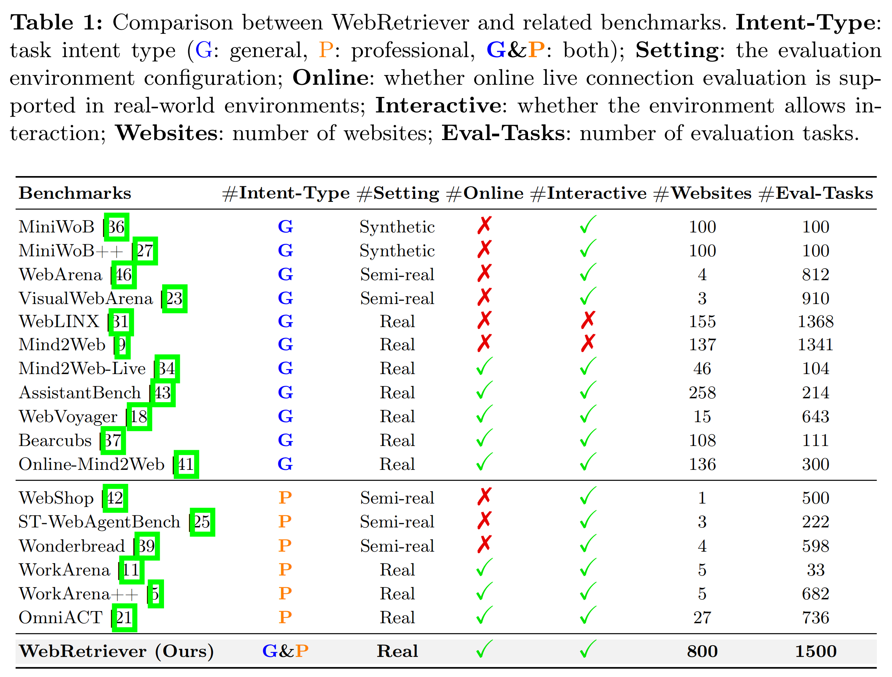
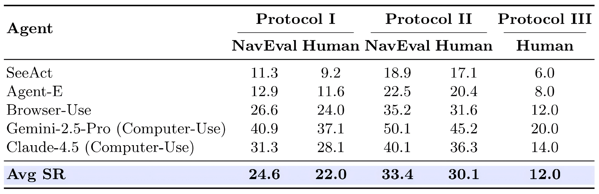
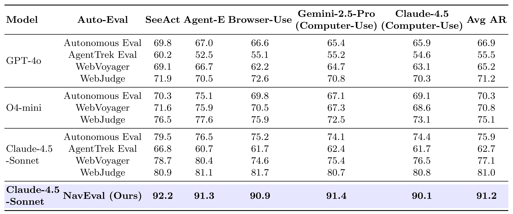
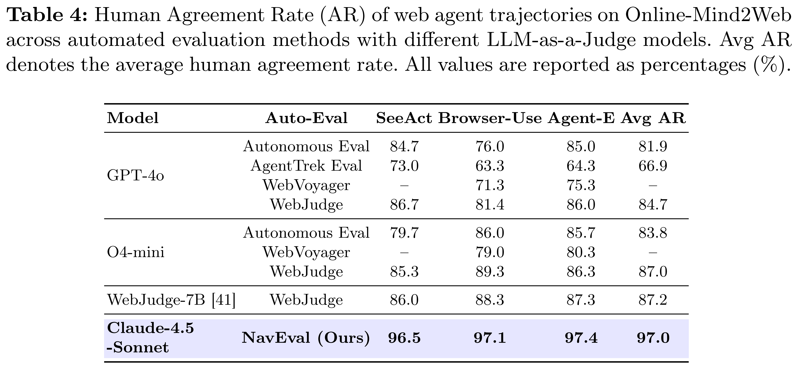

<h1 align="center">🌐 WebRetriever: A Large-Scale Comprehensive Benchmark for Efficient Web Agent Evaluation</h1>

<a href="https://github.com/hhhhhhalf/WebRetriever">📃 Paper</a>
•
<a href="https://github.com/hhhhhhalf/WebRetriever">🏆 Leaderboard</a>
•
<a href="https://github.com/hhhhhhalf/WebRetriever">🤗 Data</a>

## :bulb: Motivation

  

<em>Figure 1. Motivation for the WebRetriever benchmark. WebRetriever addresses key limitations of prior work from three aspects: dataset scale and diversity, automated evaluation reliability, and deployment-oriented evaluation protocols.</em>

## :page_facing_up: Abstract

As web agents increasingly demonstrate capabilities in automated task execution, the development of robust evaluation frameworks for assessing their navigation and task completion performance has emerged as a critical research priority. However, existing benchmarks exhibit several fundamental limitations. First, they suffer from insufficient scale and limited domain diversity, thereby constraining comprehensive evaluation of cross-domain generalization. Second, prevailing LLM-as-Judge evaluation methodologies inadequately capture fine-grained interaction semantics, particularly regarding precise query formulation and filtering operations. Third, current benchmarks predominantly emphasize navigation success metrics while neglecting critical requirements for real-world deployment scenarios. To address these limitations, we introduce WebRetriever, a large-scale benchmark encompassing 800 websites and 1,500 tasks across diverse domains, including consumer, professional, and enterprise sectors, with comprehensive coverage of user intent patterns. We propose NavEval (Navigation Evaluation), a novel LLM-as-Judge framework that leverages rich interaction context beyond visual screenshots, achieving state-of-the-art alignment with human judgment across multiple evaluation datasets. Furthermore, we establish three complementary evaluation protocols that collectively provide holistic assessment of web agent capabilities: navigation proficiency, knowledge-assisted interaction, and end-to-end task completion with information extraction. Extensive experimental analysis reveals substantial performance disparities across evaluation protocols, demonstrating that navigation success alone serves as an insufficient predictor of real-world application effectiveness. WebRetriever delivers fine-grained diagnostic insights into agent capabilities and establishes a rigorous foundation for advancing web agent research and development.

 

随着 Web Agent 在自动化任务执行方面能力的提升，构建用于评估其导航能力和任务完成表现的稳健评测框架已成为一项关键研究任务。然而，现有的基准存在若干根本性局限。首先，规模不足且领域多样性有限，从而限制了对跨域泛化能力的全面评估。其次，现行的 LLM-as-Judge 评估方法无法充分捕捉细粒度的交互语义，尤其在精确查询生成和筛选操作方面存在不足。第三，当前基准主要侧重于导航成功率指标，却忽视了真实应用场景中的关键需求。为解决这些问题，我们提出 WebRetriever，一个涵盖 800 个网站、1500 个任务、跨消费者、专业和企业等多样化领域的大规模基准，全面覆盖各类用户意图模式。同时，我们提出 NavEval（Navigation Evaluation），一种新颖的 LLM-as-Judge 框架，能够利用视觉截图之外的丰富交互上下文，在多个评估数据集上实现与人工判断一致率的最先进性能。此外，我们建立了三个互补的评估协议，以提供对 Web Agent 能力的整体性评测：导航熟练度、知识辅助交互，以及信息提取的端到端任务完成能力。广泛的实验分析显示，在不同评估协议下性能存在显著差异，表明仅依靠导航成功率不足以预测实际应用效果。WebRetriever 提供了对代理能力的细粒度诊断洞察，为推动 Web Agent 的研究与发展奠定了严谨基础。

## :star: Main Contributions
> 1. **A large-scale, comprehensive benchmark for realistic web agent evaluation:**  
We curate 1,500 tasks across 800 real websites spanning diverse domains and user intents. Compared with prior benchmarks, WebRetriever provides unprecedented scale, diversity, and coverage, enabling more comprehensive and representative evaluation of web agents in realistic online environments.
>
> 2. **A general and high-precision automated evaluation method:**  
We propose NavEval, an automated evaluation method that attains approximately 90% human-level agreement in large-scale experiments, thereby enabling practical and reliable assessment of web agent performance at scale and in real-time.
>
> 3. **Comprehensive evaluation framework:**  
We propose three complementary evaluation protocols to systematically assess web agents, explicitly disentangling navigation success from answer correctness and characterizing behavioral reliability under injected operational knowledge, thereby providing diagnostic signals missing from prior benchmarks.

## :bar_chart: Dataset Construction

  

## :brain: NavEval

  

<em>Figure 2. Workflow of NavEval. Compared to existing methods, NavEval applies rule-based filtering to extract fine-grained intermediate signals, which are then jointly reasoned with the task description, action trajectory, and final screenshot by an LLM to determine task success, enabling robust evaluation with higher human agreement rates.</em>

## :clipboard: Evaluation Protocols

  

<em>Figure 3. Workflow of the semi-automated pipeline for constructing operational documentation in Protocol II. The process integrates automated exploration, evaluation, manual refinement, and LLM-based generation to produce high-quality operational documentation.</em>

 

We design three complementary evaluation protocols for comprehensive assessment:
> 1. **Protocol I** evaluates basic navigation ability to reach target pages.
>  
> 2. **Protocol II** assesses navigation performance when provided with operational knowledge.
> 
> 3. **Protocol III** measures end-to-end task completion by jointly evaluating navigation and information extraction, avoiding the limitation of equating page arrival with task success.

## :chart_with_upwards_trend: Experiment Results

  

 

  

 

  

